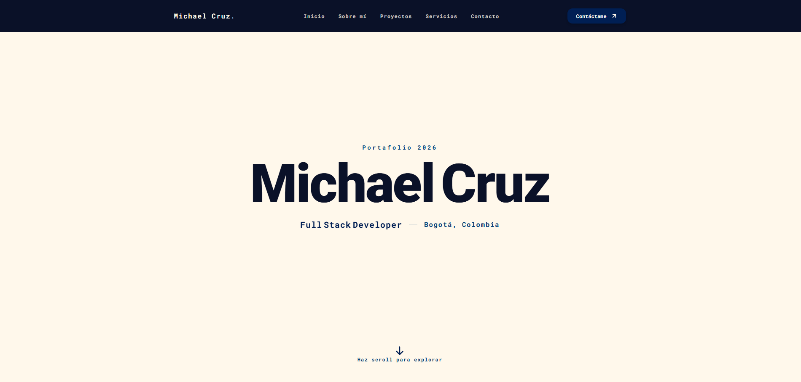
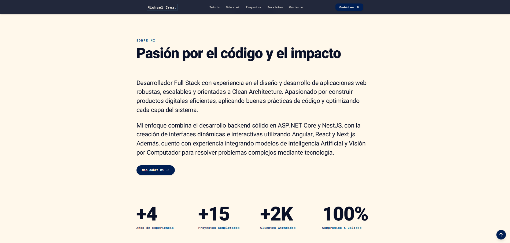
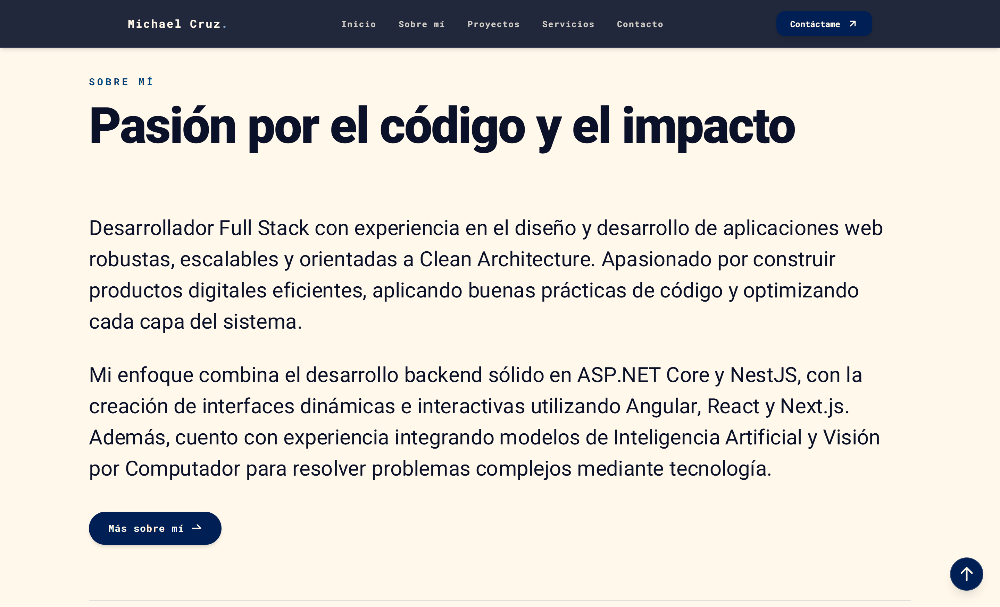
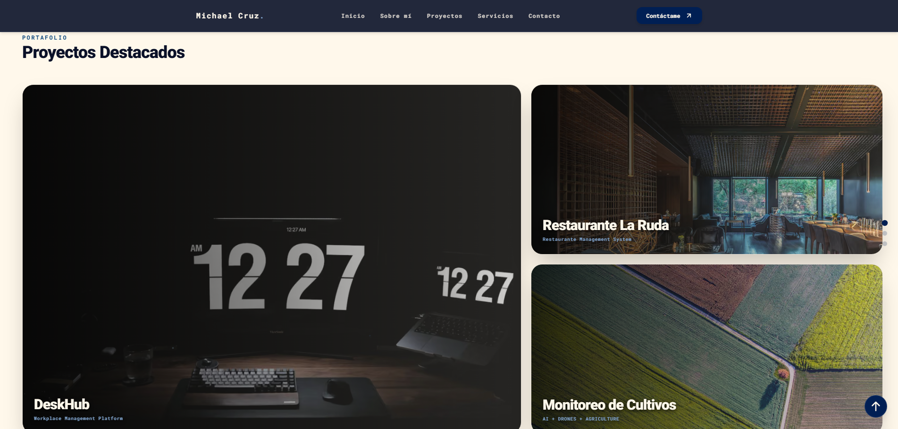
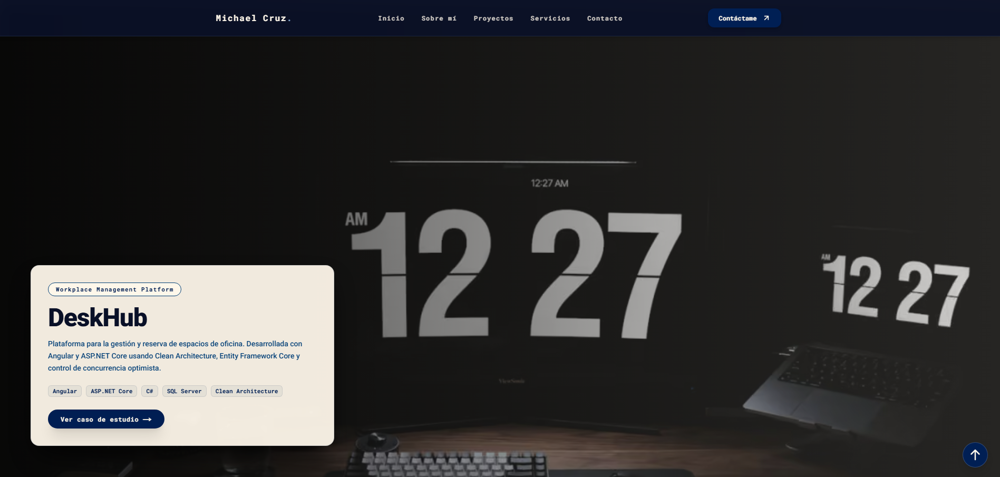
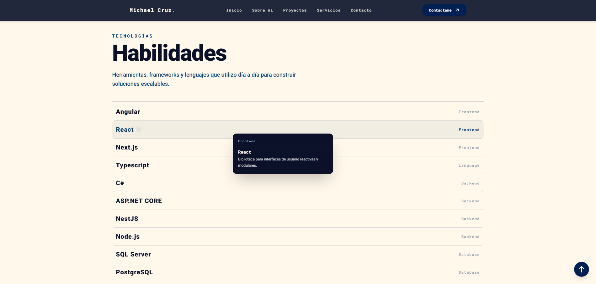
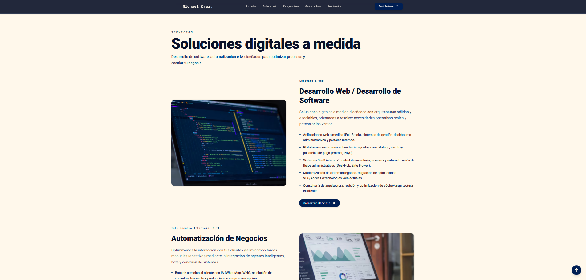
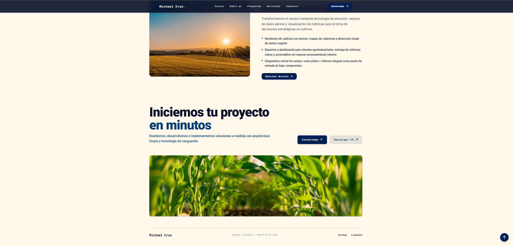

<div align="center">



# Michael Cruz — Portafolio

**Full Stack Developer · Bogotá, Colombia**

Portafolio profesional donde presento mis proyectos, habilidades y servicios en desarrollo web, automatización con IA y monitoreo agrícola con visión por computador.

[](https://elemike.vercel.app)
[](https://www.linkedin.com/in/michaelsct/)


</div>

---

## 📸 Capturas

<div align="center">



</div>

<details>
<summary><b>Ver más capturas</b></summary>
<br />

| Sobre mí | Proyectos destacados |
| --- | --- |
|  |  |

| Detalle de proyecto | Tecnologías |
| --- | --- |
|  |  |

| Servicios | Contacto y footer |
| --- | --- |
|  |  |

</details>

---

## 🚧 Estado del proyecto

El portafolio se encuentra en **desarrollo activo**.

- [x] Home page (hero, sobre mí, proyectos destacados, habilidades, servicios y contacto)
- [x] Despliegue continuo en Vercel
- [ ] Páginas de casos de estudio (DeskHub, Restaurante La Ruda, Monitoreo de Cultivos)
- [ ] Página de "Sobre mí" ampliada
- [ ] Optimización de SEO y métricas Lighthouse

## ✨ Secciones del sitio

| Sección | Descripción |
| --- | --- |
| **Inicio** | Presentación y propuesta de valor |
| **Sobre mí** | Perfil profesional y métricas destacadas |
| **Proyectos** | Proyectos destacados con stack y acceso a casos de estudio |
| **Habilidades** | Tecnologías de frontend, backend, bases de datos e IA / visión |
| **Servicios** | Desarrollo web y de software, automatización de negocios con IA y AgTech |
| **Contacto** | Correo directo y descarga de CV |

## 🗂️ Proyectos destacados

- **DeskHub** — Plataforma de gestión y reserva de espacios de oficina. Angular + ASP.NET Core con Clean Architecture, Entity Framework Core y control de concurrencia optimista.
- **Restaurante La Ruda** — Sistema de gestión para restaurantes (pedidos, mesas, menús e inventario). API REST con NestJS y frontend en React + TypeScript.
- **Monitoreo de Cultivos** — Análisis de cultivos con imágenes aéreas (DJI Mini 3 Pro). Visión por computador con YOLO para detectar anomalías y clasificar cultivos, más análisis GIS con GeoTIFF.

## 🛠️ Stack tecnológico

**Este portafolio**

- [Next.js](https://nextjs.org) (App Router)
- [TypeScript](https://www.typescriptlang.org)
- [Tailwind CSS](https://tailwindcss.com)
- [ESLint](https://eslint.org)
- Despliegue en [Vercel](https://vercel.com)

**Habilidades que presento en el sitio**

| Categoría | Tecnologías |
| --- | --- |
| Frontend | Angular, React, Next.js |
| Backend | C#, ASP.NET Core, NestJS, Node.js |
| Lenguajes | TypeScript, C#, Python |
| Bases de datos | SQL Server, PostgreSQL |
| IA / Visión | Python, OpenCV, PyTorch, YOLO |

## 🚀 Ejecutar localmente

**Requisitos:** Node.js 18.18 o superior y npm.

```bash
# 1. Clonar el repositorio
git clone https://github.com/elemike/elemike-portfolio.git
cd elemike-portfolio

# 2. Instalar dependencias
npm install

# 3. Iniciar el servidor de desarrollo
npm run dev
```

Abre [http://localhost:3000](http://localhost:3000) en tu navegador.

### Scripts disponibles

| Comando | Descripción |
| --- | --- |
| `npm run dev` | Servidor de desarrollo |
| `npm run build` | Compilación para producción |
| `npm run start` | Sirve la build de producción |
| `npm run lint` | Análisis de código con ESLint |

## 📁 Estructura del proyecto

```text
elemike-portfolio/
├── docs/
│   └── screenshots/     # Capturas usadas en este README
├── public/              # Recursos estáticos (imágenes, CV)
├── src/                 # Código fuente de la aplicación
├── eslint.config.mjs    # Configuración de ESLint
├── next.config.ts       # Configuración de Next.js
├── postcss.config.mjs   # Configuración de PostCSS
├── tailwind.config.ts   # Configuración de Tailwind CSS
└── tsconfig.json        # Configuración de TypeScript
```

## 📬 Contacto

- 🌐 Portafolio: [elemike.vercel.app](https://elemike.vercel.app)
- 💼 LinkedIn: [linkedin.com/in/michaelsct](https://www.linkedin.com/in/michaelsct/)
- 🐙 GitHub: [@elemike](https://github.com/elemike)
- ✉️ Email: elemike2004@gmail.com

---

<div align="center">

Hecho con ☕ y código por **Michael Cruz** · Bogotá, Colombia

</div>
